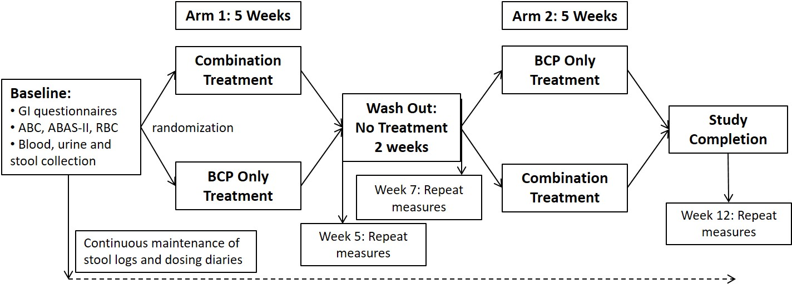
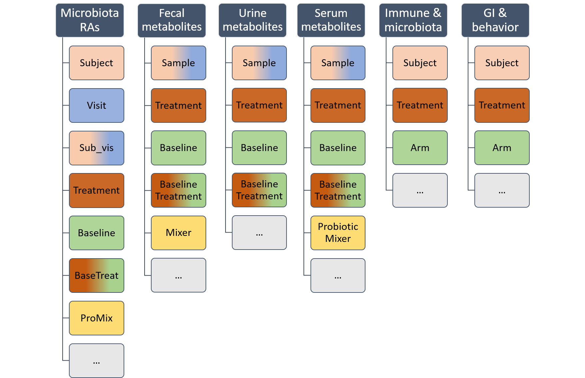
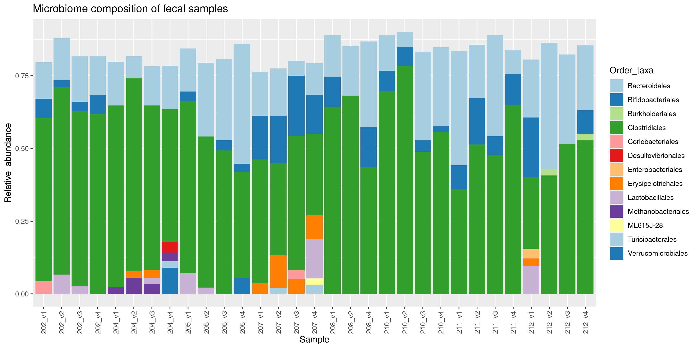
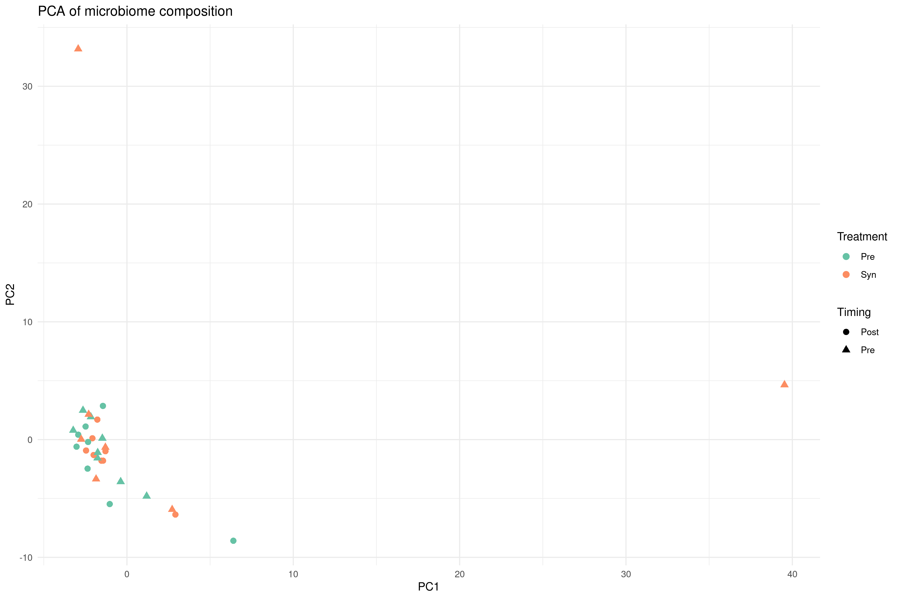
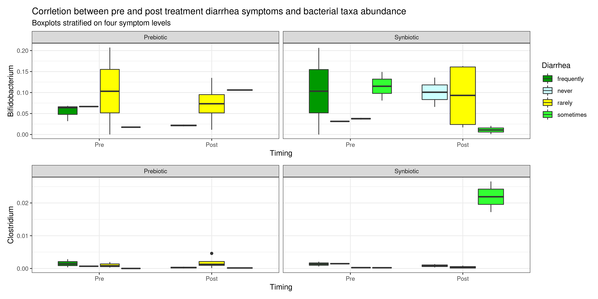
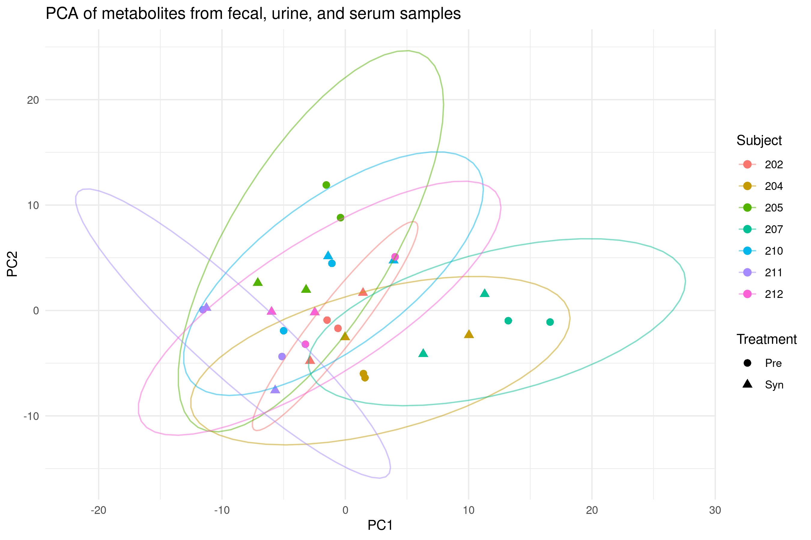
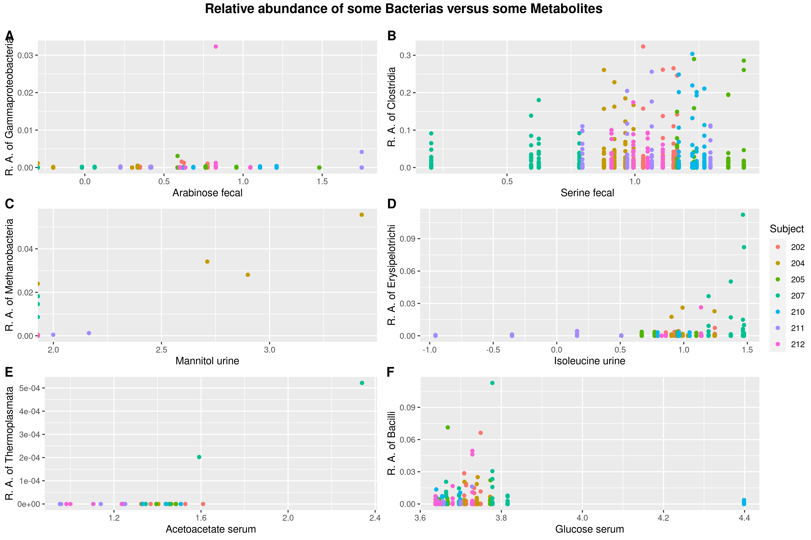
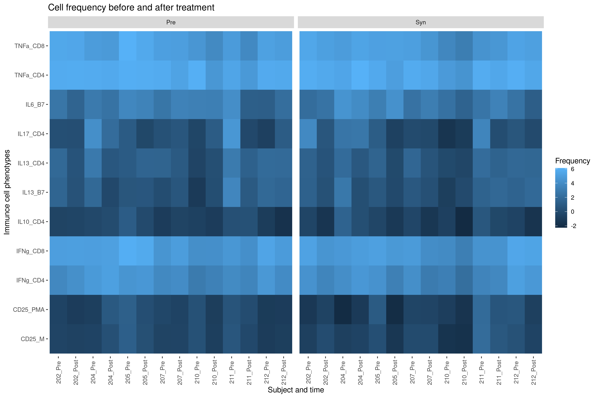

```{r setup, include=FALSE}
knitr::opts_chunk$set(echo = FALSE)
library(tidyverse)
library(knitr)
```

# Introduction 

## Study {.build}

__Sanctuary et al., 2019:__
Pilot study of probiotic/colostrum supplementation on gut function in children with autism and gastrointestinal symptoms

> - Prebiotic (Bovine Milk Oligosaccharides) or synbiotic (BMO + _B. infantis_) treatment
 - Autism symptoms
 - Gastrointestinal symptoms
 - Metabolites from fecal, urine, and serum samples
 - Immune cell populations in blood
 - Microbiota of fecal samples

## Data


Study design:

```{r out.width='100%'}

```


## Data

Excel file with six sheets:


```{r include=FALSE}
fecal_metabolites = read_tsv(file = "../data/01_fecal_metabolites.tsv")
serum_metabolites = read_tsv(file = "../data/01_serum_metabolites.tsv")
urine_metabolites = read_tsv(file = "../data/01_urine_metabolites.tsv")
GI_behavior = read_tsv(file = "../data/01_GI_behavior.tsv")
immune_microbiota = read_tsv(file = "../data/01_immune_microbiota.tsv")
microbiota_ras = read_tsv(file = "../data/01_microbiota_ras.tsv")
stool_data = read_tsv(file = "../data/02_stool_data.tsv")
final_data = read_tsv(file = "../data/03_final_data_clean_aug.tsv")

```


```{r out.width='90%'}

```


# Methods

## Tidying data

- Align column names
- Change entries with typos
- Assign NAs
- Remove undesired and empty columns
- Filter out redundancy


## Tidying data

immune_microbiota data issue:

```{r}
immune_microbiota %>% 
  select(1:5)
```

## Tidying data

GI_behavior data issue:

```{r}
GI_behavior %>% 
  select(1:6)
```

## Tidying data

Data from stool log excluded:

```{r}
str(stool_data)
```

## Joining data

full_join() of all tables into final_data:

```{r}
str(final_data)
```


## Data analysis {.build}

Exploring the data:

> - Behavior vs. treatment
- GI symptoms vs. treatment
- Behavior related to microbiome
- GI symptoms related to microbiome
- Microbiome changes (PCA)
- Metabolite changes
- Immune cell population changes

# Results


## Change in abberant behavior after treatment

```{r, out.width='88%', fig.align='center'}
include_graphics("../results/06_ABC_plot.png", error = F)
```

## Behavioral scores of subject "202" and "212" 

```{r, out.width='88%', fig.align='center'}
include_graphics("../results/06_ABC_plot_subject_202-212.png", error = F)
```

## Gastrointestinal symptoms

```{r, out.width='95%', fig.align='center'}
include_graphics("../results/07_Gastrointestinal_symptoms_bar_plot.png", error = F)
```


## Microbiome composition

```{r out.width='100%'}

```

## PCA of microbiomes

```{r out.width='95%'}

```

## Aberrant behavior vs. taxa abundance

```{r, out.width='100%', fig.align='center'}
include_graphics("../results/08_ABC_vs_taxa_scatterplot.png", error = F)
```


## Gastrointestinal symptoms vs. taxa abundance 

```{r out.width='100%'}

```

## PCA of metabolome

```{r out.width='95%'}

```

## Correlations of some metabolites and bacterial taxa

```{r out.width='90%'}


```


## Immune cell phenotypes
```{r out.width='95%'}

```


# Discussion

## Discussion {.build}

> - Improved autism symptoms
- Improved gastrointestinal symptoms

But why?

> - Perhaps immune cells
- More subjects needed
- Longer test period


